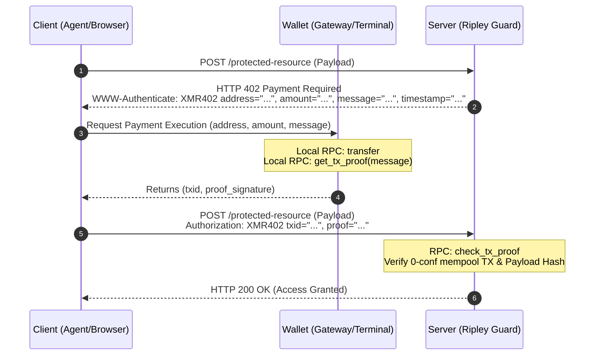
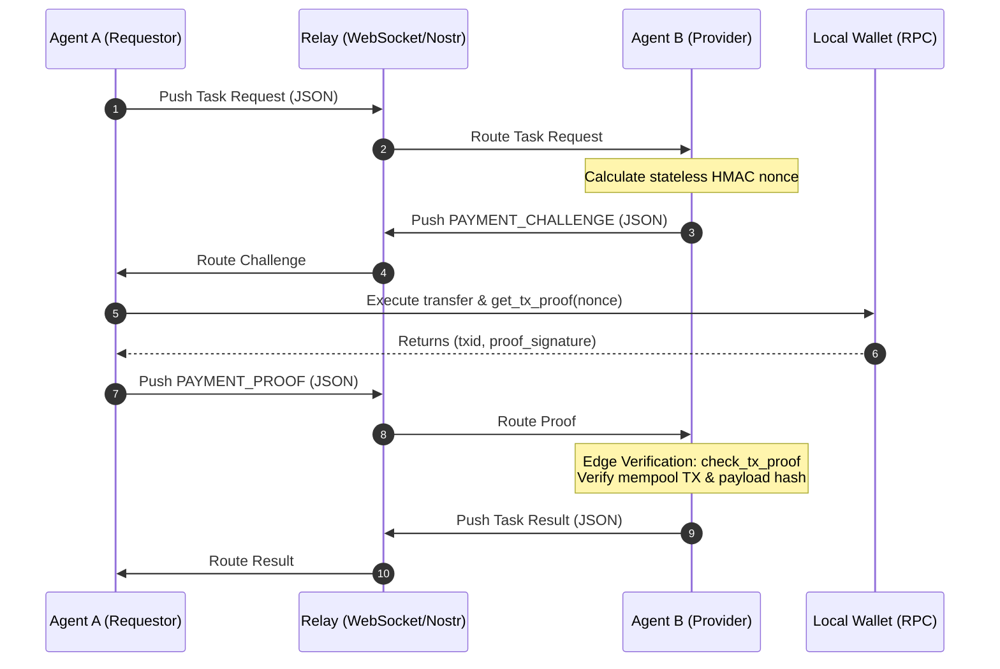

# XMR402: The Stateless, Anonymous Payment Primitive for the Machine Economy

* **An agnostic protocol for agents, context retrieval, APIs, and P2P relays**
* **Drafted by: [@XBToshi](https://x.com/xbtoshi)**
* **[XMR402.org](https://xmr402.org) / [@XMR402](https://x.com/xmr402) / Protocol Spec / x402**
* **Draft v2.0 / March 2026**

## Abstract
The internet is shifting. Human browsing is out; autonomous AI agents are in. But the underlying payment infrastructure is stuck in Web2. Credit cards, account registrations, fiat gateways—AI agents don't have bank accounts. Hit a paywall, and they just crash. 

XMR402 proposes a native, censorship-resistant machine-to-machine (M2M) payment protocol. By fusing stateless cryptographic intent binding with Monero (XMR) transaction proofs (TX Proofs), XMR402 lets any client buy network resources in milliseconds. No sign-ups. No identity leaks. No waiting for block confirmations. 

In v2.0, XMR402 evolves beyond a simple HTTP middleware. It is now a **transport-agnostic primitive**, ready to secure API gateways, P2P WebSocket relays, and darknet hidden services alike.

## 1. The Dead End of Legacy Tech
Current crypto payment gateways and Web3 agent standards (like ERC-8183) are bloated. They suffer from four fatal flaws:
1. **State Bloat:** Servers have to maintain order databases, generate unique receiving addresses, and constantly poll nodes. It's a DDoS nightmare.
2. **Confirmation Latency:** Traditional on-chain payments take minutes to hours. For an API call demanding a millisecond response, that's a joke.
3. **Privacy Leaks:** Transparent ledgers expose an AI agent's money flow and behavioral footprint. 
4. **Smart Contract Toll Booths:** Web3 ecosystems force agents to use heavy on-chain escrow contracts to trade. This introduces massive gas fees and relies on the blockchain as a slow, expensive middleman.

## 2. The Decoupled Architecture (v2.0)
To scale infinitely, XMR402 drops the database entirely. It relies purely on math. The protocol splits the cryptographic verification from the network transport layer into three distinct modules:

* **`xmr402-core`**: The pure cryptographic engine. It handles intent binding, HMAC nonce generation, and `check_tx_proof` validation. Zero network dependencies.
* **`xmr402-http`**: The Web middleware. It implements IETF HTTP 402 standards, handling Headers and RESTful API gating.
* **`xmr402-ws`**: The Relay binding. Uses standardized JSON frames for P2P agent communication behind NATs or on Nostr relays. Dumb pipes, smart edges.

## 3. Transport Layer I: The HTTP Flow
For traditional API gateways, XMR402 hijacks the "order" concept and goes back to the stateless roots of HTTP. The protocol operates in three tactical phases, illustrated in the flow below:

When an agent hits a protected resource, the Guard intercepts it and returns an `HTTP 402 Payment Required` status. It drops the payment specs inside the standard `WWW-Authenticate` header. This includes the receiving subaddress, the amount in atomic units (piconeros), and a dynamic, intent-bound nonce (`message`).

The agent broadcasts the transaction, grabs the TX hash, and calls the local Monero wallet's `get_tx_proof`. It re-fires the identical HTTP request, packing the cryptographic credential into the `Authorization` header.

## 4. Transport Layer II: The Relay Flow
Agents running locally without public IPs cannot receive HTTP callbacks. XMR402-WS solves this by passing JSON frames over persistent WebSocket connections. 

Instead of heavy smart contracts acting as middlemen, agents use simple messaging relays (like Nostr). The relay is just a dumb pipe. The validation happens entirely at the edge.

The serving agent (Agent B) pushes a `PAYMENT_CHALLENGE` JSON frame. The requesting agent (Agent A) processes the payment locally through its own node and pushes the `PAYMENT_PROOF` frame back. The relay stays dumb, fast, and free. No gas fees, no waiting for blocks.

## 5. Tactical Breakthroughs

### Hyper-Speed: Mempool 0-Conf

Monero's privacy hides the sender and the amount. But its proof mechanism lets us cryptographically verify that a specific transaction paid a specific amount to a specific address. By checking the mempool, we crush the crypto payment delay from 10 minutes down to 200 milliseconds.

### Intent Binding: Defeating the Bait-and-Switch

To prevent instruction replacement attacks, the server dynamically calculates a stateless HMAC-SHA256 hash using a server secret, the client's IP, and a **hash of the request payload**.
When the proof returns, the server recalculates this binding. A payment for a cheap text prompt cannot be reused for an expensive rendering task. The machine intent is locked down. No database. Massive concurrency. Military-grade security.

### Defending Wallet Bloat

Traditional privacy gateways demand a new address per invoice. High traffic instantly kills the node's wallet scanning engine. XMR402 routes all requests to a single subaddress. We rely on Monero's on-chain stealth addresses for absolute privacy, and use the HMAC nonce to completely kill replay attacks.

## 6. The Component Matrix

XMR402 isn't just an isolated repo. It's the foundational protocol for autonomous economies. We built three standard components around it:

* **Guard (The Shield):** Stateless middleware deployed on the server side or relay edge. Issues challenges and verifies proofs.
* **Gateway (The Sword):** A tactical wallet interface bolted onto AI Agents. Gives models the power to read 402s or JSON challenges, pay autonomously, and breach firewalls.
* **Terminal (The Anchor):** The human control deck. Triggers via Deep Link (`xmr402://`) when a browser hits a 402, offering one-click signature clearance.

## 7. The Endgame

Code is law. Cryptography is consensus. Ethereum builds heavy, stateful toll booths for agents. XMR402 builds the stateless, invisible highway. We seamlessly weld modern transport standards with Monero's anonymity. We are dropping this protocol to serve as the permissionless blood engine for the imminent AI machine economy.

