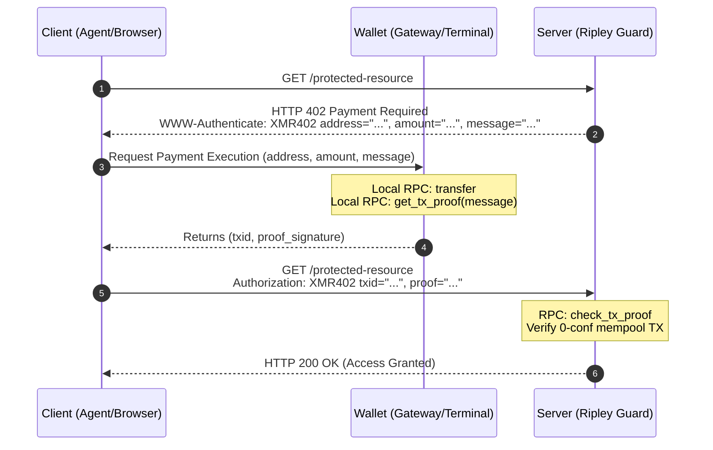

# 📜 XMR402 Protocol Specification (v1.0.1)

XMR402 is a stateless, decentralized HTTP payment gating protocol. Designed specifically for AI Agents and sovereign users, it leverages Monero (XMR) transaction proofs (TX Proof) to enable millisecond-level 0-conf (zero-confirmation) resource unlocking.

The protocol is fully compatible with IETF HTTP authentication standards, allowing it to seamlessly traverse Nginx, Cloudflare, and other reverse proxies.

## 🌊 The Tactical Flow



## 🔐 Deep Link Schema (`xmr402://`)

To facilitate seamless integration with OS-level wallets, the standard URI schema is:

```http
xmr402://<address>?amount=<piconero>&message=<nonce>&return_url=<callback>
```

- **address**: The recipient Monero address.
- **amount**: The requested payment in atomic units.
- **message**: The server-provided nonce for replay protection.
- **return_url** *(optional)*: A URL-encoded callback address (introduced in v1.0.1). If provided, the terminal MUST execute a transparent handback by appending `xmr402_txid` and `xmr402_proof` as query parameters and routing the user back to the web UI.

## 🔐 Header Standards

### 1. Server-Side Challenge
When an unauthorized request arrives, the server MUST intercept and return HTTP 402, attaching payment instructions in the header:
```http
WWW-Authenticate: XMR402 address="<subaddress>", amount="<piconero>", message="<nonce>", timestamp="<unix_ms>"
```
- **address**: The Monero subaddress designated for this specific transaction.
- **amount**: The required payment amount in atomic units (Piconero, 1 XMR = 1e12).
- **message**: A unique, stateless anti-replay string (Nonce). To prevent **instruction replacement attacks**, the nonce MUST be bound to the request payload:
  `nonce = HMAC(server_secret, client_ip + payload_hash + url + time_window)`
- **timestamp**: The current server time in milliseconds. Recommended for clients to synchronize their local time window.

### 2. Client-Side Proof
After completing the payment and obtaining the TX Proof, the client includes the credentials in a standard Authorization header and retries the request:
```http
Authorization: XMR402 txid="<hash>", proof="<signature>"
```
- **txid**: The transaction hash broadcast to the Mempool.
- **proof**: The cryptographic signature generated via `get_tx_proof`.
