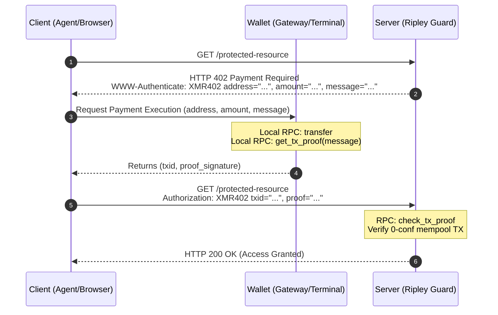

# XMR402: The Stateless, Anonymous Payment Layer for the Machine Economy


* **An HTTP based protocol for agents, context retrieval, APIs, and more**
* **Drafted by: @XBToshi**
* **[XMR402.org](XMR402.org) / Protocol Spec / x402**
* **Draft v1.0.1 / March 2026**

## Abstract
The internet is shifting. Human browsing is out; autonomous AI agents are in. But the underlying payment infrastructure is stuck in Web2. Credit cards, account registrations, fiat gateways—AI agents don't have bank accounts. Hit a paywall, and they just crash. 

XMR402 proposes a native, censorship-resistant machine-to-machine (M2M) payment protocol. By fusing the IETF HTTP 402 status code with Monero (XMR) cryptographic transaction proofs (TX Proofs), XMR402 lets any client buy network resources in milliseconds. No sign-ups. No identity leaks. No waiting for block confirmations.

## 1. The Dead End of Legacy Tech
Current crypto payment gateways (like BTCPayServer) are bloated. They suffer from three fatal flaws:
1. **State Bloat:** Servers have to maintain order databases, generate unique receiving addresses, and constantly poll nodes. It's a DDoS nightmare.
2. **Confirmation Latency:** Traditional on-chain payments take minutes to hours. For an API call demanding a millisecond response, that's a joke.
3. **Privacy Leaks:** Transparent ledgers expose an AI agent's money flow and behavioral footprint. 

## 2. XMR402 Core Mechanics
XMR402 ditches the "order" concept entirely. It goes back to the stateless roots of HTTP. The protocol operates in three tactical phases, illustrated in the flow below:



### 2.1 The Challenge

When a client hits a protected resource, the server intercepts it and returns an `HTTP 402 Payment Required` status. It drops the payment specs inside the standard `WWW-Authenticate` header.
This includes the receiving subaddress, the amount in atomic units (piconeros), and a dynamic, anti-replay nonce (`message`).

```http
WWW-Authenticate: XMR402 address="8...", amount="5000000000", message="nonce123"

```

### 2.2 Execution & Proof

The client (human terminal or AI gateway) broadcasts the transaction. After grabbing the TX hash, it calls the local Monero wallet's `get_tx_proof`. Crucially, it mixes the server's `message` into the signature payload, generating a cryptographic credential strictly bound to the current session.

If the request is from a human via browser deep link (`xmr402://`), the client may provide a `return_url`. The wallet Terminal will transparently execute a callback by appending the `txid` and `proof` to the `return_url` and bouncing the user back to the web portal.

### 2.3 Zero-Conf Verification

The client (either via the Agent script or the Browser intercepting the callback) simply re-fires the identical HTTP request, packing the credential into the header:

```http
Authorization: XMR402 txid="<hash>", proof="<signature>"

```

The server extracts the proof and hits the Monero node with a lightweight `check_tx_proof` query. As long as the transaction is valid in the mempool and the amount matches, the server instantly fires back a `200 OK` and releases the payload.

## 3. Tactical Breakthroughs

### Hyper-Speed: Mempool 0-Conf

Monero's privacy hides the sender and the amount. But its proof mechanism lets us cryptographically verify that a specific transaction paid a specific amount to a specific address. By checking the mempool, we crush the crypto payment delay from 10 minutes down to 200 milliseconds.

### Absolute Statelessness: The HMAC Engine

The server stores zero nonces. It dynamically calculates an HMAC-SHA256 hash using a server secret, the client's IP, and a time window to generate the `message`. When the proof comes back, the server recalculates the hash and compares. No database. Massive concurrency.

### Defending Wallet Bloat

Traditional privacy gateways demand a new address per invoice. High traffic instantly kills the node's wallet scanning engine. XMR402 routes all requests to a single subaddress. We rely on Monero's on-chain stealth addresses for absolute privacy, and use the HMAC nonce to completely kill replay attacks.

## 4. The Component Matrix

XMR402 isn't just an isolated repo. It's the foundational protocol for autonomous economies. We built three standard components around it:

* **Guard (The Shield):** Stateless middleware deployed on the server side. Issues challenges and verifies proofs.
* **Gateway (The Sword):** A tactical wallet interface bolted onto AI Agents. Gives models the power to read 402s, pay autonomously, and breach firewalls.
* **Terminal (The Anchor):** The human control deck. Triggers via Deep Link when a browser hits a 402, offering one-click signature clearance.

## 5. The Endgame

Code is law. Cryptography is consensus. XMR402 seamlessly welds IETF HTTP standards with Monero's anonymity. We are dropping this protocol to serve as the permissionless blood engine for the imminent AI machine economy.